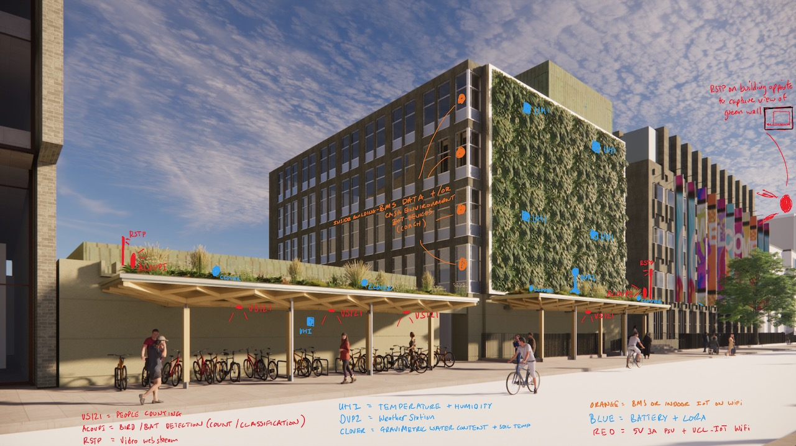
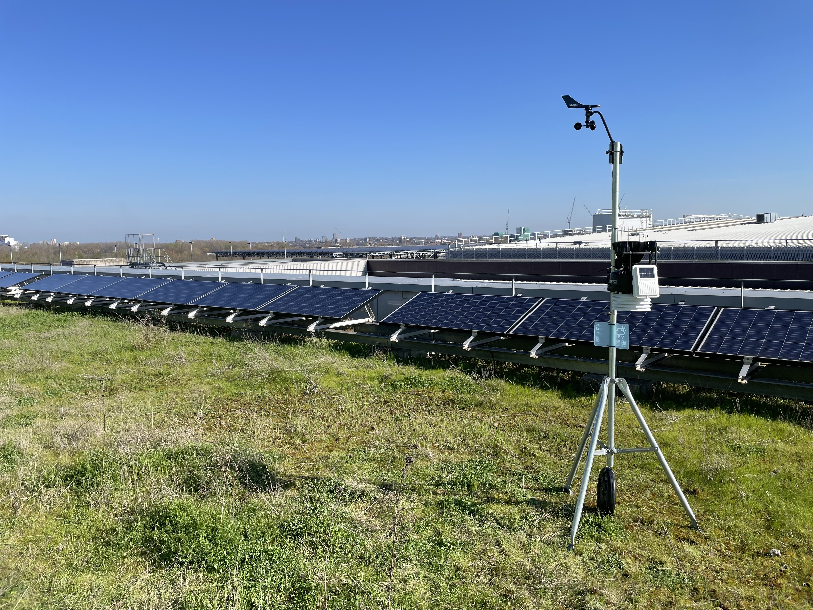
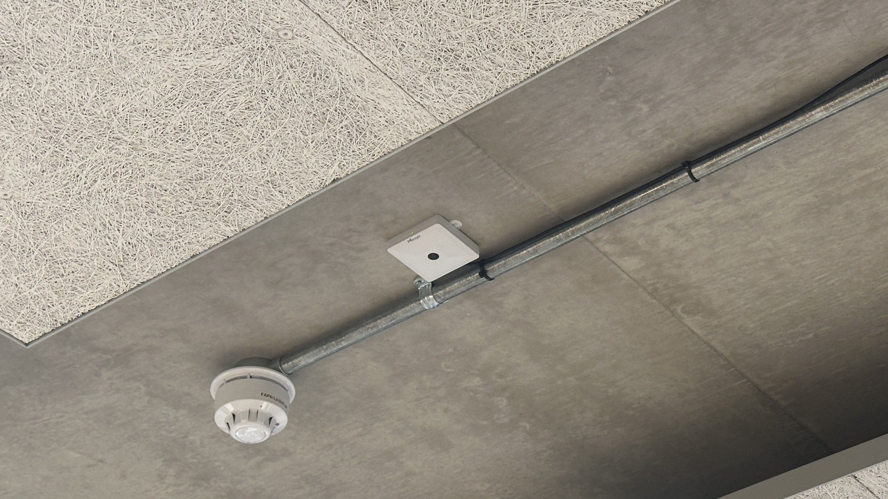
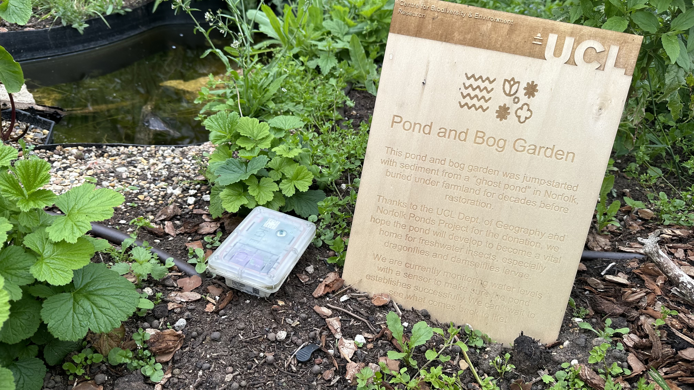
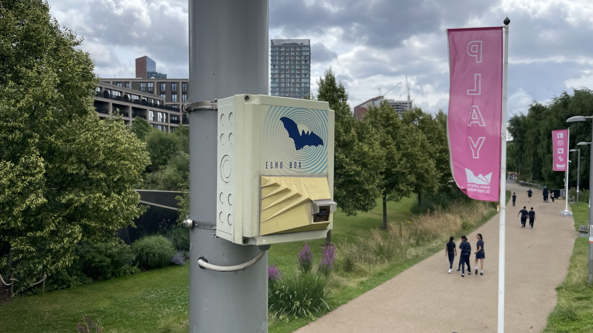
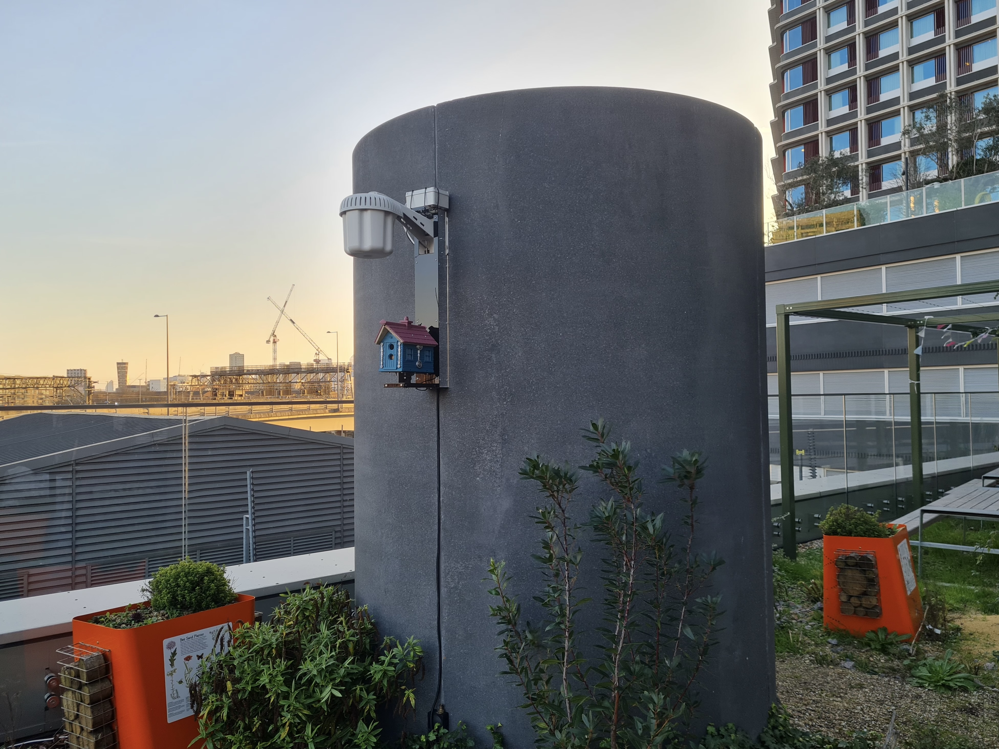
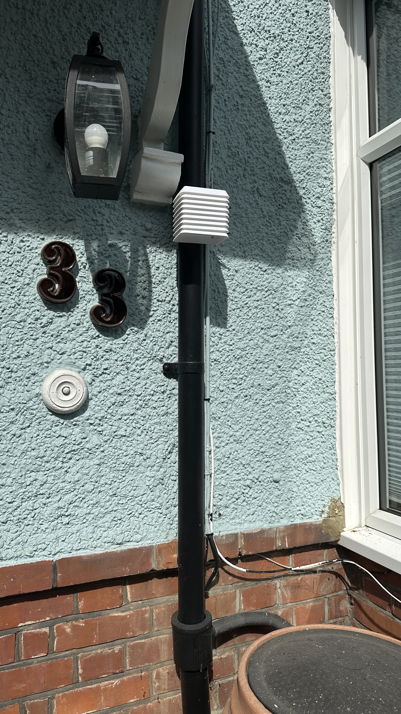

# Sensing Equipment

Below is a list of the planned sensors being installed. The overview sketch shows the approximate suggested locations, the table of data and images are provided as a guide for what will be installed.

_Overview of sensor locations_

### Weather Station

Davis Vantage Pro2 (VP2) - measures Temperature, Humidity, Wind speed, Wind direction, Rainfall, Barometric Pressure, Solar Radiation, UV. Mounted on a tripod on top of the green canopy. Console (data receiver) to be installed in adjacent building. [Product link](https://www.davisinstruments.com/pages/vantage-pro2). Components required:

SKU DI-6327CM [Davis Cabled Integrated Sensor Suite 6327C for Pro2 Plus](https://www.weathershop.co.uk/davis-6327-vantage-pro2-iss-plus-cabled)

SKU DI-6316CUK [Davis Cabled Weather Envoy 6316C](https://www.weathershop.co.uk/davis-6316-vantage-pro2-envoy-cabled)

SKU DI-6510USB [WeatherLink 2.0 Windows Software & USB Data Logger](https://www.weathershop.co.uk/accessories/spares-by-brands/davis-spare-parts-accessories/davis-6510-weatherlink-usb) 

SKU DI-7716-00 [Mounting Tripod](https://www.weathershop.co.uk/accessories/spares-by-brands/davis-spare-parts-accessories/davis-7716-tripod)

### VS121 - People Counter

Vision based people counter (Milesight VS121) - counts the volume and flow of people using the space to quantify social use and engagement. Installed under the canopy, top down view of the pedestrianised area. [Product Link](https://www.milesight.com/iot/product/lorawan-sensor/vs121). (Note: square sensor in middle of image shown is VS121, against a smoke alarm for size comparison)

SKU VS121 [The USB C variant of the VS121](https://www.milesight.com/iot/product/lorawan-sensor/vs121)

### Clover Soil Sensor

Soil Moisture Sensor (Tektelic Clover) - monitors soil moisture levels to assess plant health, irrigation needs, and rainwater attenuation performance. Embedded within the green roof growing medium. [Product Link](https://tektelic.com/products/sensors/clover-agriculture-sensor/).

SKU Clover EU868 [TEKTELIC CLOVER Agriculture Soil Moisture Sensor Surface Version - EU868](https://connectedthings.store/gb/lorawan-sensors/agriculture-sensors/tektelic-agriculture-soil-moisture-sensor-surface-version.html)

### Microphone

Acoupi (bespoke Raspberry Pi based sensor unit) - measures ambient sound to monitor species and general ecological activity of bats and birds. Records sound frequencies to identify and track avian life.	Installed on post on the green canopy. An existing installation is shown to give an indication of appearance. 

Echobox Acoustic Sensor on lamp post (Bat / Bird Monitor)

### Camera
Visual Sensor (bespoke Raspberry Pi based unit)	- live stream of  visual data (video) of green canopy to monitor species and general ecological activity. Installed on post on the green canopy and focused on patch of green roof. An existing installation is shown to give an indication of appearance.

Birdbox Visual Sensor (Camera and Microphone) - shown here as blue "Bird House"

### Urban Heat Island

Bespoke UHI Sensor - sensor	measures ambient air temperature and humidity to assess the direct cooling impact of the green infrastructure. Positioned to compare the microclimate adjacent to the green wall / canopy with the broader street environment. [Project Page](https://mandymadongyi.github.io/UrbanHeatSense.IoT/about.html).

